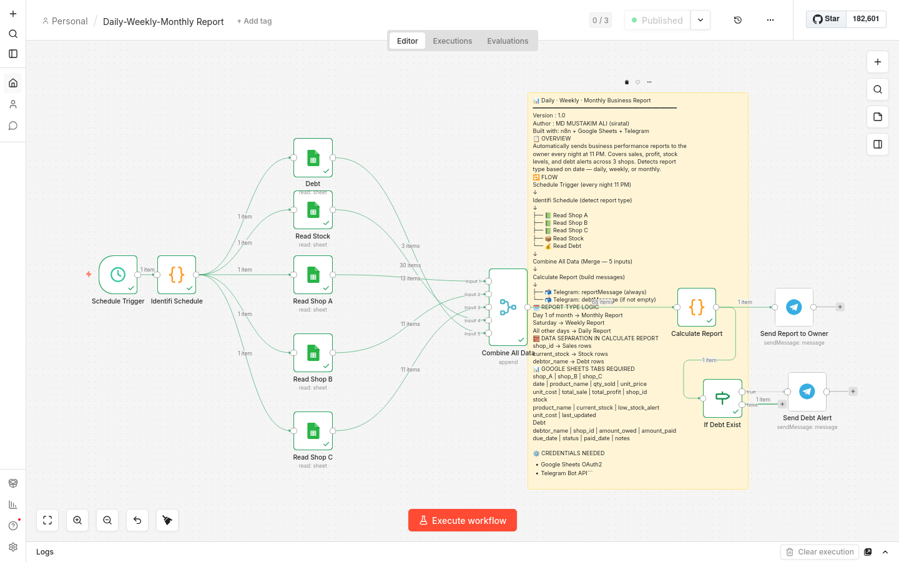

# 📊 Daily · Weekly · Monthly Business Report Automation

An automated business reporting workflow built with **n8n** that sends real-time **Telegram messages** to the owner every night with sales, profit, stock, and debt summaries across 3 shops.

> Built as a portfolio project to demonstrate real-world automation for small business management using no-code/low-code tools.

---

## 📸 Workflow Preview

(workflow-preview-executions.png)

---

## ✨ Features

- 📊 **Daily Report** — Revenue, profit, top product per shop, stock alerts, and debt summary every night
- 📈 **Weekly Report** — Shop rankings, best day, profit margin, and week's debt collected every Saturday
- 🗓️ **Monthly Report** — vs target, top 3 products, shop rankings, and debt recovery on the 1st of each month
- 💰 **Debt Alert** — Separate instant Telegram alert when debt activity exists (paid, overdue, due today, due tomorrow)
- 🔁 **Smart Detection** — Automatically detects which report to send based on today's date
- 🛡️ **Duplicate Prevention** — Single Merge node ensures exactly one execution per night
- 📦 **Stock Monitoring** — Flags low stock items in every report automatically
- ⏰ **Fully Automated** — Runs every night at 11 PM, no manual intervention needed

---

## 🔁 Workflow Flow

```
Schedule Trigger (every night 11 PM)
  ↓
  Identifi Schedule (detect report type)
  ↓
  ├── 📗 Read Shop A
  ├── 📗 Read Shop B
  ├── 📗 Read Shop C
  ├── 📦 Read Stock
  └── 💰 Read Debt
        ↓
  Combine All Data (Merge — 5 inputs)
        ↓
  Calculate Report (build messages)
        ↓
  ├── 📬 Telegram: reportMessage (always)
  └── If Debt Exist
        └── 📬 Telegram: debtMessage (only when debt activity exists)
```

---

## 🗓️ Report Type Logic

| Condition | Report Type |
|---|---|
| 1st of the month | Monthly Report |
| Saturday | Weekly Report |
| All other days | Daily Report |

To change the weekly day — edit `=== 6` in the Identifi Schedule node
`(0=Sun  1=Mon  2=Tue  3=Wed  4=Thu  5=Fri  6=Sat)`

---

## 🛠️ Tech Stack

| Tool | Purpose |
|------|---------|
| n8n | Workflow automation engine |
| Google Sheets | Sales, stock, and debt records |
| Telegram Bot API | Owner report delivery |

---

## 📊 Google Sheets Structure

One spreadsheet with **5 tabs:**

**shop_A / shop_B / shop_C** (identical structure)

| Column | Description |
|--------|-------------|
| `date` | Sale date — format YYYY-MM-DD |
| `product_name` | Name of product sold |
| `qty_sold` | Quantity sold |
| `unit_price` | Selling price per unit (৳) |
| `unit_cost` | Buying/cost price per unit (৳) |
| `total_sale` | Auto formula — =qty_sold × unit_price |
| `total_profit` | Auto formula — =qty_sold × (unit_price − unit_cost) |
| `shop_id` | Fixed value: shop_a / shop_b / shop_c |

**stock**

| Column | Description |
|--------|-------------|
| `product_name` | Must match sales tabs exactly |
| `current_stock` | Current inventory count |
| `low_stock_alert` | Alert threshold |
| `unit_cost` | Current buying price |
| `last_updated` | Date last updated |

**Debt**

| Column | Description |
|--------|-------------|
| `debtor_name` | Name of person who owes money |
| `shop_id` | Which shop the debt is from |
| `amount_owed` | Original debt amount (৳) |
| `amount_paid` | Amount paid so far (৳) |
| `due_date` | Payment due date — format YYYY-MM-DD |
| `status` | `pending` / `partial` / `paid` |
| `paid_date` | Date payment was received |
| `notes` | Optional description |

---

## ⚙️ Setup & Installation

### Prerequisites
- n8n instance (self-hosted or cloud)
- Google Sheets with OAuth2 credentials
- Telegram Bot (create via [@BotFather](https://t.me/botfather))

### Steps

**1. Clone this repo**
```bash
git clone https://github.com/Siratalm/business-report-automation.git
```

**2. Import the workflow**
- Open your n8n instance
- Go to **Workflows → Import from file**
- Select `workflow.json`

**3. Configure credentials**
- Connect your **Google Sheets OAuth2** account
- Connect your **Telegram Bot API** token

**4. Update Spreadsheet ID**
- Replace the Spreadsheet ID in all 5 Google Sheets nodes with your own
- Your ID is in the sheet URL: `docs.google.com/spreadsheets/d/YOUR_ID/edit`

**5. Set your owner Chat ID**
- In both Telegram nodes, replace the Chat ID with your own
- Get yours by messaging [@userinfobot](https://t.me/userinfobot)

**6. Set your monthly budget target**
- In the Calculate Report node, find this line:
- `const BUDGET = 1200000;`
- Replace `1200000` with your actual monthly revenue target in ৳

**7. Activate the workflow**
- Click **Publish** (cloud) or toggle **Active** (self-hosted)
- It will now run automatically every night at 11 PM

---

## 📩 Sample Telegram Messages

**Daily Report**
```
📊 Daily Business Report
Monday, 6 April 2026
────────────────────────

Shop A
Total Sales: ৳ 18,450
Total Profit: ৳ 4,200
Top Product: Rice (5kg) — 24 units

Shop B
Total Sales: ৳ 14,800
Total Profit: ৳ 3,100
Top Product: Cooking Oil (1L) — 18 units

Shop C
Total Sales: ৳ 21,300
Total Profit: ৳ 5,600
Top Product: Sugar (1kg) — 31 units

────────────────────────
Combined Today
Total Revenue: ৳ 54,550
Total Profit: ৳ 12,900
Total Units Sold: 147
────────────────────────
Stock Alerts
⚠️ Cooking Oil (1L) — 6 units
⚠️ Sugar (1kg) — 8 units
────────────────────────
— Auto Report
```

**Debt Alert**
```
💰 Debt Alert
Monday, 6 April 2026
────────────────────────

🔔 Due Today
• Rahim Mia — ৳ 3,500

🚨 Overdue
• Salam Khan — ৳ 3,000 (5d late)

────────────────────────
Total outstanding: ৳ 6,500
2 open debt(s)
```

---

## 🗂️ Project Structure

```
business-report-automation/
│
├── workflow.json        # n8n workflow export
├── README.md            # Project documentation
└── workflow-preview.png # Canvas screenshot
```

---

## 🚀 Future Improvements

- [ ] Low stock instant alert when sheet is updated
- [ ] Staff sales entry reminder at 8 PM nightly
- [ ] Monthly expense tracker for true net profit
- [ ] Debt overdue escalation (3 days, 7 days warnings)
- [ ] Weekly comparison vs previous week
- [ ] Supplier payment tracker

---

## 👤 Author

**Md Mustakim Ali (siratal)**
- GitHub: [@Siratalm](https://github.com/Siratalm)
- Built with n8n | Open to automation freelance projects

---

## 📄 License

This project is open source and available under the [MIT License](LICENSE).
